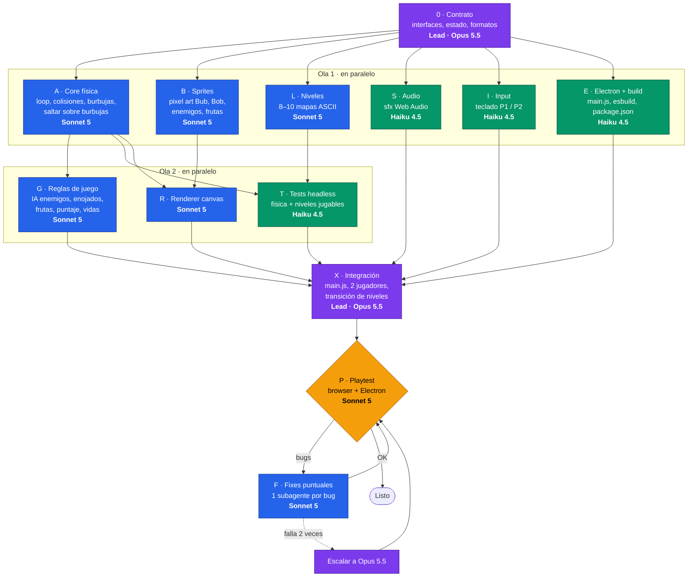

# Bubble Bobble — Plan de vibe coding

Clon del Bubble Bobble (Taito, 1986) en JavaScript. El mismo código corre en el **browser** (`index.html`) y como **app de escritorio** (Electron).

## Alcance acordado
- 8–10 niveles con distintos diseños de plataformas
- Correr, saltar, disparar burbujas, atrapar y reventar enemigos
- Frutas y bonus al reventar enemigos
- Enemigos que escapan enojados (más rápidos) si no se revienta la burbuja a tiempo
- Saltar sobre las burbujas (usarlas como plataformas)
- Modo 2 jugadores (Bub y Bob) en el mismo teclado
- Pixel art dibujado por código (sin archivos de imagen)
- Sonidos sintetizados con Web Audio (salto, burbuja, pop, fruta)

## Arquitectura (pensada para paralelizar)
La clave para repartir el trabajo entre subagentes es que cada módulo tenga una interfaz fija y no dependa del DOM salvo donde es inevitable. Cada subagente recibe solo el contrato y su módulo, así su contexto es chico y barato.

```
bubble-bobble/
├── CONTRACT.md          # interfaces, forma del estado, formatos de datos (lo escribe el lead)
├── src/
│   ├── core/            # JS puro, sin DOM: loop, física, entidades, reglas
│   ├── data/levels.js   # niveles como mapas ASCII
│   ├── data/sprites.js  # pixel art como matrices de colores
│   ├── render/canvas.js # dibuja el estado en un <canvas>
│   ├── audio/sfx.js     # efectos con Web Audio
│   ├── input/keys.js    # teclado, mapeo P1 / P2
│   └── main.js          # une todo
├── index.html           # entrada browser
├── electron/main.js     # ventana de escritorio que carga index.html
└── tests/               # tests del core en Node (sin browser)
```

- **Browser y Electron comparten el 100% del código.** Electron es Chromium, así que canvas y Web Audio funcionan igual.
- **Un solo bundle** (`esbuild src/main.js → dist/game.js`), porque Chrome bloquea módulos ES abiertos por `file://`. `index.html` y Electron cargan el mismo `dist/game.js`.
- **El core no toca el DOM**, así los tests corren en Node y los subagentes de física y reglas no necesitan un navegador.

## Grafo de ejecución



**Camino crítico:** `0 → A → G → X → P`. Es lo único que no se puede paralelizar y marca el tiempo total. Opus 5.5 queda solo en el contrato y la integración, donde un error se propaga a todo. El resto corre en paralelo y termina antes.

**Regla de escalado:** si un nodo en Sonnet falla el mismo problema 2 veces (típicamente la física de burbujas-plataforma en A), ese problema puntual se pasa a Opus 5.5 con contexto chico. No se relanza el nodo entero.

## Subagentes

| Nodo | Tarea | Modelo | Por qué ese modelo | Contexto que recibe |
|---|---|---|---|---|
| 0 | Contrato de interfaces | Opus 5.5 | Las decisiones de diseño condicionan todo lo demás | Este PLAN.md |
| A | Core física | Sonnet 5 | Lo más difícil, pero el contrato lo acota. Escala a Opus si se traba | CONTRACT.md |
| B | Sprites | Sonnet 5 | Creativo pero acotado | CONTRACT.md (formato sprite) |
| L | Niveles | Sonnet 5 | Hay que pensar si cada nivel es jugable | CONTRACT.md (formato nivel) |
| S | Audio | Haiku 4.5 | Mecánico, poco código | CONTRACT.md (API sfx) |
| I | Input | Haiku 4.5 | Trivial | CONTRACT.md (API input) |
| E | Electron + build | Haiku 4.5 | Boilerplate conocido | CONTRACT.md (estructura) |
| R | Renderer | Sonnet 5 | Moderado, depende de sprites | CONTRACT.md + sprites.js |
| G | Reglas de juego | Sonnet 5 | Lógica moderada sobre un core ya resuelto | CONTRACT.md + core/ |
| T | Tests headless | Haiku 4.5 | Tests sobre APIs definidas | CONTRACT.md + core/ + levels.js |
| X | Integración | Opus 5.5 | Une todo y resuelve inconsistencias | Todo src/ |
| P | Playtest | Sonnet 5 | Encuentra bugs y los reparte en fixes | Juego corriendo |
| F | Fixes | Sonnet 5 | Un bug concreto con contexto chico | Bug + archivo afectado |

## Por qué esto es más barato que una sola sesión
1. **Contexto chico por subagente.** En una sesión única cada turno vuelve a leer todo el historial, y eso es lo que más gasta. Acá cada subagente arranca de cero con solo el contrato y su módulo.
2. **Modelo según la dificultad.** Solo 2 de 13 nodos usan Opus (contrato e integración). Datos, boilerplate y tests van a Haiku o Sonnet, que cuestan entre 1/4 y 1/2.
3. **El contrato evita retrabajo.** Si las interfaces están fijadas desde el principio, la integración no obliga a reescribir módulos.
4. **Los fixes van a subagentes chicos**, en vez de agrandar la sesión principal.

## Estimación

| | Sesión única (Opus 5.5) | Grafo con subagentes |
|---|---|---|
| Tokens de entrada | 10–18M | ~5–9M |
| Tokens de salida | 250–450K | ~250–400K |
| Costo API | ~US$12–25 | **~US$5–10** (hasta ~US$12 si hay que escalar) |
| Tiempo de pared | ~3–5 h | **~1,5–2,5 h** |

Precios de sep-2026 por 1M tokens (entrada / salida / lectura de caché): Opus 5.5 $4 / $20 / $0,20 · Sonnet 5 $2 / $10 / ~$0,20 · Haiku 4.5 $1 / $5 / $0,10.
Con la cuenta de CookUnity en Claude Code se descuenta de la cuota de uso, no se cobra por token.

## Para retomar
Abrir una sesión en esta carpeta y decir:
> "Leé PLAN.md, escribí el CONTRACT.md (nodo 0) y mostrámelo antes de lanzar la ola 1."

Revisar el contrato a mano antes de lanzar la ola 1 es lo que más plata ahorra: un error ahí se multiplica por 6 subagentes.
