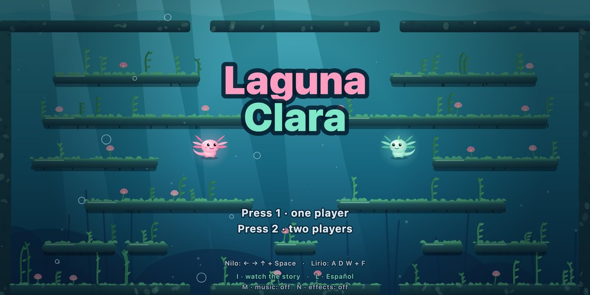

# Laguna Clara

[Español](README.md) · **English**



Two axolotls, Nilo and Lirio, clean up their lagoon one bubble at a time. A
single-screen platformer inspired by the bubble arcade games of the 80s: trap
the polluted animals in bubbles, pop them, watch each one turn back into the
creature it used to be, and rescue the axolotl babies.

- **100 levels across 10 zones**, from The Shore to The Drain. Each zone
  introduces a new enemy and ends with a boss (Big Bottle, Ghost Net, Captain
  Can… all the way to The Great Stain).
- **The water reacts to your progress**: as you clean a level, its color,
  light, plants and music open up.
- **One or two players** on the same computer; one on phones.
- **Everything is drawn and synthesized in code**: no image or audio files
  (Canvas 2D + Web Audio).
- 2:1 widescreen (56×26 tiles).
- **In English and Spanish** (press `L` on the title screen, or tap ES/EN on mobile).

## Screenshots

| | |
|---|---|
|  |  |
| The water starts out dirty… | …and clears up as you free the animals. |
|  |  |
| Every zone ends with a boss. | The story, in six panels. |
|  |  |
| The ending, with every baby you rescued. | On phones, with touch controls. |

Screenshots are regenerated with `npm run screenshots`.

## How to play

| | Nilo (P1) | Lirio (P2) |
|---|---|---|
| Swim | ← → | A D |
| Jump | ↑ | W |
| Bubble | Space | F |

`1` / `2`: start with one or two players · `P`: pause · `M`: music · `N`: effects ·
`I` (title): watch the story · `L` (title): switch language ·
← → on the title: pick an unlocked zone.

Nilo blows bigger, slower bubbles; Lirio's are smaller and faster.

## Running it

Requires Node 18 or newer.

```bash
npm install
```

```bash
npm run build
```

Then open `index.html` with any static server (for example
`python3 -m http.server`), or run it as a desktop app:

```bash
npm run desktop
```

### Mobile (iPhone and Android)

The [`mobile/`](mobile/README.md) folder packages the same game with Capacitor
and adds touch controls. iOS needs Xcode; Android needs Android Studio.

## Tests

```bash
npm test
```

They cover physics, bubbles, bosses, determinism, and that all 100 levels can
be fully traversed.

## Layout

- `src/core/`: deterministic simulation (physics, players, enemies, bosses, rules).
- `src/data/`: zones, level generator and boss arenas.
- `src/render/hd/`: drawing (heroes, enemies, world, intro, ending).
- `src/audio/`: sound effects and music.
- `src/i18n.js`: Spanish and English text.
- `CONTRACT.md`: rules and constants shared by every module.
