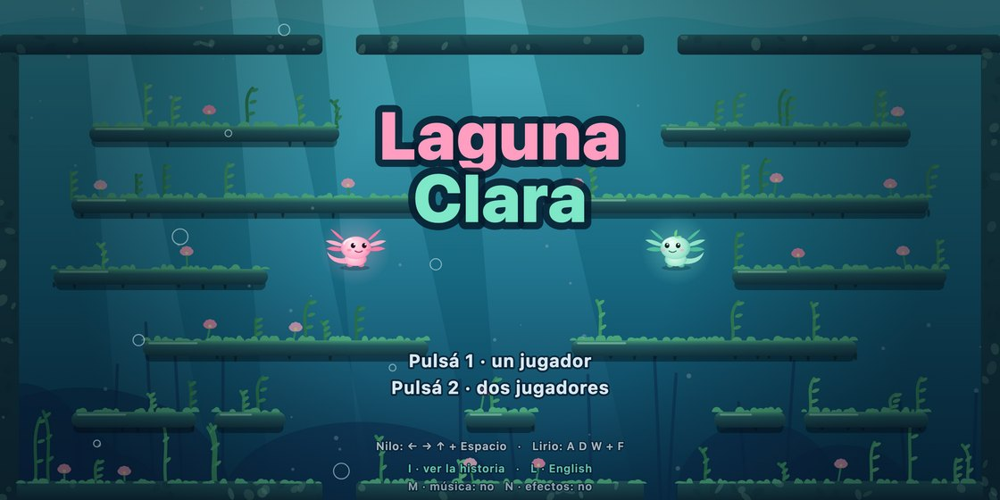
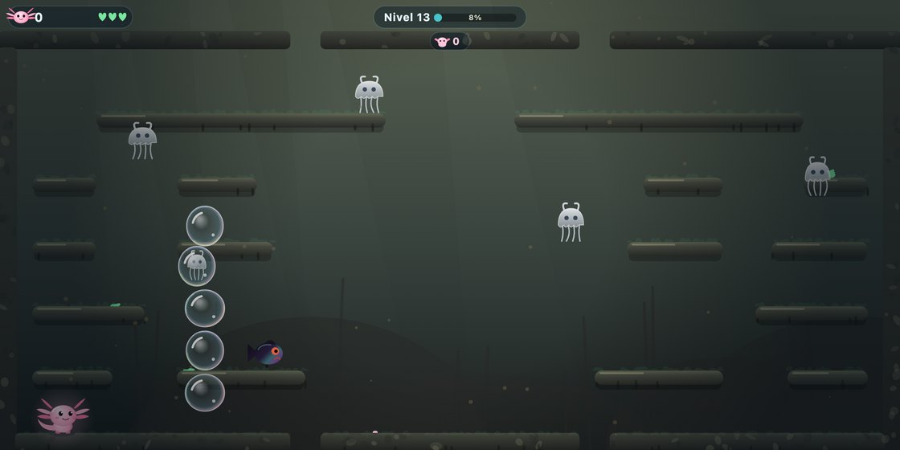
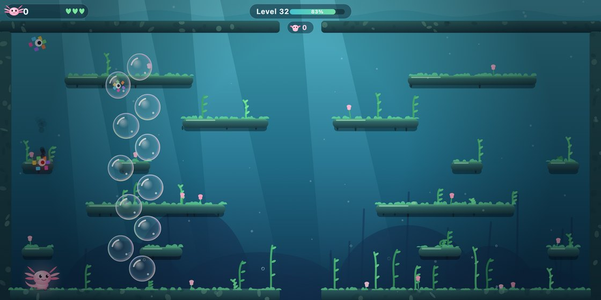
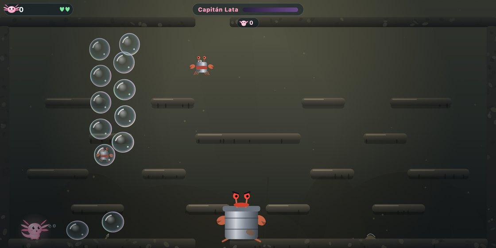
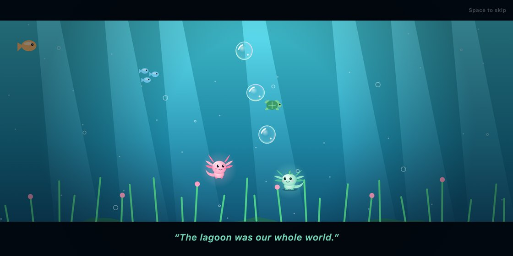
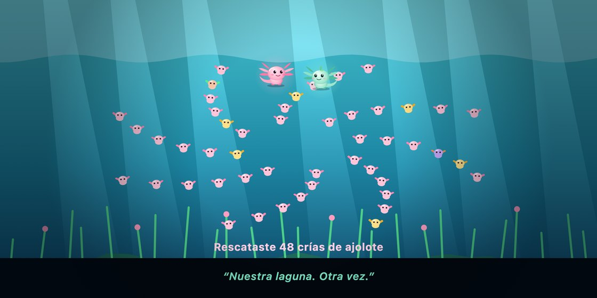
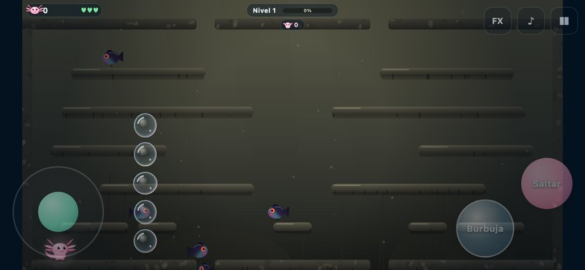

# Laguna Clara

**Español** · [English](README.en.md)



Dos ajolotes, Nilo y Lirio, limpian su laguna a burbujazos. Un juego de
plataformas de una sola pantalla, inspirado en los arcade de burbujas de los
80: atrapás a los animales contaminados en burbujas, las reventás, el animal
vuelve a ser el que era y rescatás a las crías de ajolote.

- **100 niveles en 10 zonas**, de La Orilla a El Caño. Cada zona presenta un
  enemigo nuevo y termina con un jefe (Botellón, Red Fantasma, Capitán Lata…
  hasta La Gran Mancha).
- **El agua cambia con tu progreso**: a medida que limpiás el nivel, el color,
  la luz, las plantas y la música se van abriendo.
- **Uno o dos jugadores** en la misma compu. En el celular, uno.
- **Todo dibujado y sintetizado en código**: no usa imágenes ni archivos de
  audio (Canvas 2D + Web Audio).
- Pantalla ancha 2:1 (56×26 casillas).
- **En español y en inglés** (tecla `L` en el título, o el botón ES/EN en mobile).

## Capturas

| | |
|---|---|
|  |  |
| El agua empieza sucia… | …y se aclara a medida que liberás a los animales. |
|  |  |
| Cada zona termina con un jefe. | La historia, en seis viñetas. |
|  |  |
| El final con las crías que rescataste. | En el celular, con controles táctiles. |

Las capturas se regeneran con `npm run screenshots`.

## Cómo jugar

| | Nilo (P1) | Lirio (P2) |
|---|---|---|
| Nadar | ← → | A D |
| Saltar | ↑ | W |
| Burbuja | Espacio | F |

`1` / `2`: empezar con uno o dos jugadores · `P`: pausa · `M`: música · `N`: efectos ·
`I` (en el título): ver la historia · `L` (en el título): cambiar el idioma ·
← → en el título: elegir una zona ya desbloqueada.

Nilo tira burbujas más grandes y lentas; Lirio, más chicas y rápidas.

## Correrlo

Requiere Node 18 o más nuevo.

```bash
npm install
```

```bash
npm run build
```

Después abrí `index.html` con cualquier servidor estático (por ejemplo,
`python3 -m http.server`) o como app de escritorio:

```bash
npm run desktop
```

### Mobile (iPhone y Android)

La carpeta [`mobile/`](mobile/README.md) empaqueta el mismo juego con Capacitor
y le agrega controles táctiles. Para iOS hace falta Xcode; para Android, Android
Studio.

## Tests

```bash
npm test
```

Cubren física, burbujas, jefes, determinismo y que los 100 niveles se puedan
recorrer enteros.

## Estructura

- `src/core/`: simulación determinista (física, jugadores, enemigos, jefes, reglas).
- `src/data/`: zonas, generador de niveles y arenas de jefe.
- `src/render/hd/`: el dibujo (héroes, enemigos, mundo, intro, final).
- `src/audio/`: efectos y música.
- `src/i18n.js`: textos en español e inglés.
- `CONTRACT.md`: las reglas y constantes que comparten todos los módulos.
